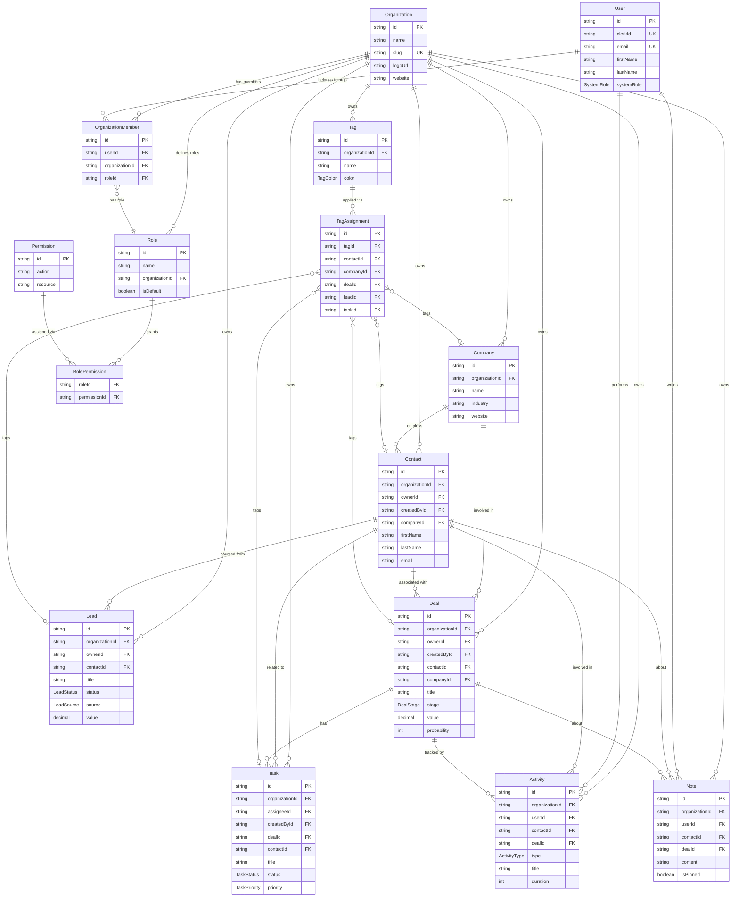

# CRM Database Schema

## Architecture Overview

This CRM uses a **multi-tenant architecture** where `Organization` is the tenant boundary. Every CRM entity (contacts, deals, leads, tasks, etc.) belongs to an organization, ensuring complete data isolation between tenants.

## ER Diagram (Mermaid)



## Models

### Core Tenancy

| Model                  | Description                                                    |
| ---------------------- | -------------------------------------------------------------- |
| **Organization**       | Tenant boundary. All CRM data is scoped to an organization.    |
| **User**               | Authenticated via Clerk. Can belong to multiple organizations. |
| **OrganizationMember** | Join table: User ↔ Organization, with a Role.                  |

### RBAC

| Model              | Description                                              |
| ------------------ | -------------------------------------------------------- |
| **Role**           | Named role within an org (e.g., Admin, Manager, Member). |
| **Permission**     | Action + Resource pair (e.g., `create` + `contact`).     |
| **RolePermission** | Join table: Role ↔ Permission (many-to-many).            |

### CRM Entities

| Model             | Description                                                                      |
| ----------------- | -------------------------------------------------------------------------------- |
| **Company**       | Business entity. Has many contacts and deals.                                    |
| **Contact**       | Individual person. Belongs to org, optionally to a company. Has owner + creator. |
| **Lead**          | Sales opportunity in early stage. Can link to a contact.                         |
| **Deal**          | Sales pipeline item. Links to contact + company. Has stage, value, probability.  |
| **Task**          | Action item. Can belong to a deal and/or contact. Has assignee + creator.        |
| **Activity**      | Logged interaction (call, email, meeting, etc.). Links to contact + deal.        |
| **Note**          | Free-text annotation. Links to contact and/or deal. Can be pinned.               |
| **Tag**           | Label with color, scoped to org. Applied via TagAssignment (polymorphic).        |
| **TagAssignment** | Polymorphic join: Tag ↔ Contact/Company/Deal/Lead/Task.                          |

## Enums

| Enum           | Values                                                                                         |
| -------------- | ---------------------------------------------------------------------------------------------- |
| `SystemRole`   | `SUPER_ADMIN`, `USER`                                                                          |
| `LeadStatus`   | `NEW`, `CONTACTED`, `QUALIFIED`, `UNQUALIFIED`, `CONVERTED`                                    |
| `LeadSource`   | `WEBSITE`, `REFERRAL`, `SOCIAL_MEDIA`, `EMAIL_CAMPAIGN`, `COLD_CALL`, `ADVERTISEMENT`, `OTHER` |
| `DealStage`    | `PROSPECTING`, `QUALIFICATION`, `PROPOSAL`, `NEGOTIATION`, `CLOSED_WON`, `CLOSED_LOST`         |
| `TaskStatus`   | `TODO`, `IN_PROGRESS`, `COMPLETED`, `CANCELLED`                                                |
| `TaskPriority` | `LOW`, `MEDIUM`, `HIGH`, `URGENT`                                                              |
| `ActivityType` | `CALL`, `EMAIL`, `MEETING`, `NOTE`, `TASK`, `OTHER`                                            |
| `TagColor`     | `GRAY`, `RED`, `ORANGE`, `YELLOW`, `GREEN`, `BLUE`, `PURPLE`, `PINK`                           |

## Key Relationships

```
Organization ─┬─ Members (User + Role)
              ├─ Companies ─── Contacts
              ├─ Contacts ──┬── Deals ──── Tasks
              │             ├── Leads
              │             ├── Activities
              │             └── Notes
              ├─ Deals ─────┬── Tasks
              │             ├── Activities
              │             └── Notes
              ├─ Tags ──────── TagAssignments → Contact | Company | Deal | Lead | Task
              └─ Roles ─────── Permissions
```

## Multi-Tenancy Pattern

Every query-able CRM model has an `organizationId` foreign key. This ensures:

1. **Data isolation**: Contacts in Org A are invisible to Org B
2. **Scoped indexes**: All indexes include `organizationId` for query performance
3. **Cascade deletes**: Deleting an org removes all its data
4. **User sharing**: A User can belong to multiple orgs via `OrganizationMember`

## Seed Data

Run `npm run db:seed` to populate the database with sample data:

- 1 organization (Acme Corp)
- 3 users (Admin, Manager, Member) with role assignments
- 3 roles with 28 permissions (7 resources × 4 CRUD actions)
- 3 companies, 4 contacts, 3 leads, 3 deals
- 4 tasks, 4 activities, 3 notes, 5 tags with 6 assignments
